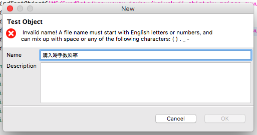
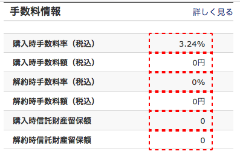
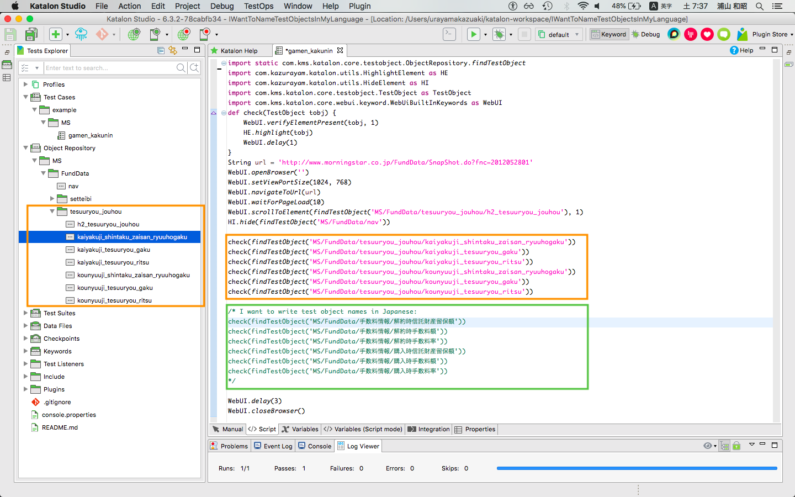

I want to name Test Objects in my native language
==========

# Problem to solve

Katalon Studio upto version 7 has a prbolem of Internationalization. I can not name a Test Object in my native language (ja_JP).
When I try to use characters which are native for me, Katalon Studio rejects it.



This restriction frustrates me quite sometimes.

October 1, 2019, the consumption tax rate will increase from 8% to 10%. Therefore many web developers in Japan are busy changing their web sites to make it complying to the new rate. I am involved as well. I have developped a lot of Katalon Studio tests to check if prices/fees/commission of finacial instruments displayed on web pages. This jos is much frustrating. Why? You would see the reason in the following screenshots.

In the target web pages, I see the following portion where a set of commissions of a finantial instrument are displayed. The lables (e.g, 購入時手数料率（税込）) are significant. I must respect the names.




Now I want to verify the decimal values displayed there. So I developed a Katalon Studio test using Test Objects stored in the Object Repository.



The test case script has a fragment like this:

```
check(findTestObject('MS/FundData/tesuuryou_jouhou/kaiyakuji_shintaku_zaisan_ryuuhogaku'))
check(findTestObject('MS/FundData/tesuuryou_jouhou/kaiyakuji_tesuuryou_gaku'))
check(findTestObject('MS/FundData/tesuuryou_jouhou/kaiyakuji_tesuuryou_ritsu'))
check(findTestObject('MS/FundData/tesuuryou_jouhou/kounyuuji_shintaku_zaisan_ryuuhogaku'))
check(findTestObject('MS/FundData/tesuuryou_jouhou/kounyuuji_tesuuryou_gaku'))
check(findTestObject('MS/FundData/tesuuryou_jouhou/kounyuuji_tesuuryou_ritsu'))
```

I find a problem here. The name of a Test Object `tesuuryou_jouhou/kaiyakuji_shintaku_zaisan_ryuuhogaku` is not intuitive for me. Rather, I want to name it as `手数料情報/解約時信託財産留保額` in user's own native language (Japanese for me) like this:

```
check(findTestObject('MS/FundData/手数料情報/解約時信託財産留保額'))
check(findTestObject('MS/FundData/手数料情報/解約時手数料額'))
check(findTestObject('MS/FundData/手数料情報/解約時手数料率'))
check(findTestObject('MS/FundData/手数料情報/購入時信託財産留保額'))
check(findTestObject('MS/FundData/手数料情報/購入時手数料額'))
check(findTestObject('MS/FundData/手数料情報/購入時手数料率'))
```

The latter format is much more readable for me than the former. But the current Katalon Studio does not allow me to write as such.

# Demo

https://github.com/kazurayam/IWantToNameTestObjectsInMyLanguage

Execute `Test Cases/example/MS/gamen_kakunin`

# Requirement

I want to name Test Objects and the folders using Japanese Kanji/Hiragana/Katakana characters. Others may want Cyrillic alphabet, Arabic alphabet, Chinese characters and so on. All of these should be considers as long as they are defined in the UNICODE.


